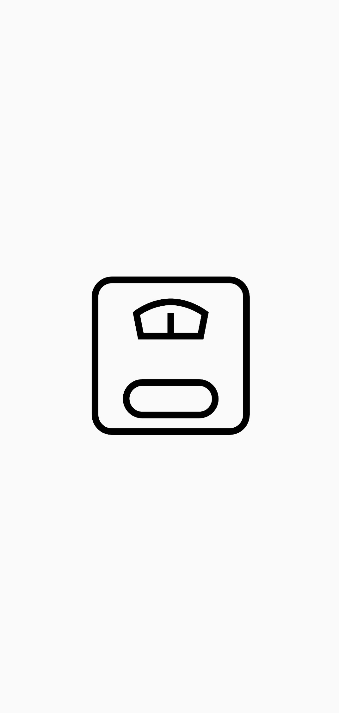
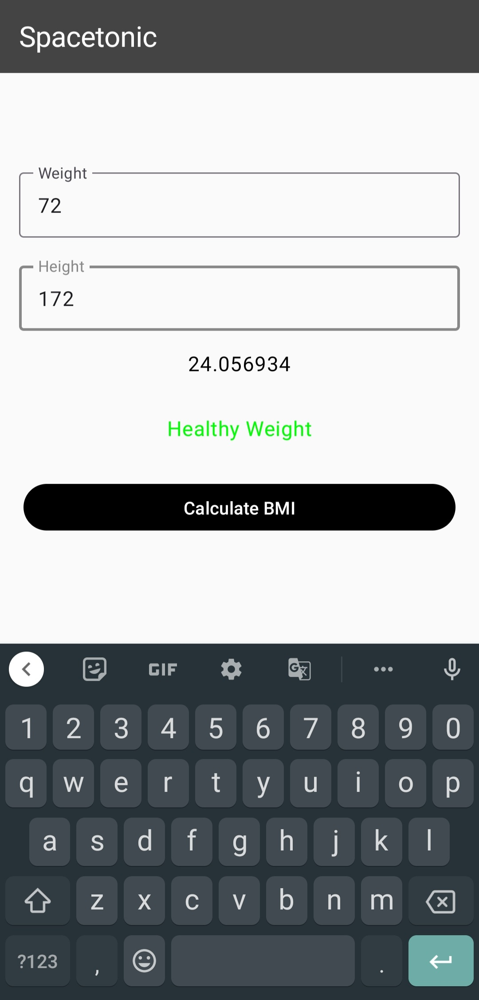

# Spacetonic
A simple jetpack compose kotlin application to calculate user bmi

# Screenshots:

# GDSC_submission
Repository to access tasks given for GDSC recruitments 2023

## Backend Submissions
1. [Pet Store Api](https://github.com/Prasanjit-4/PetStoreApi)
2. [Store My Files](https://github.com/Prasanjit-4/fileUpDown)

## App Submissions
1. [Aster App](https://github.com/Prasanjit-4/AsterApp)
2. [Spacetonic](https://github.com/Prasanjit-4/Spacetonic)
